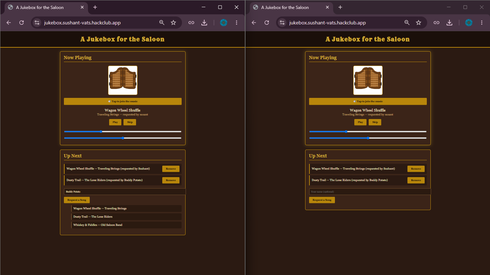
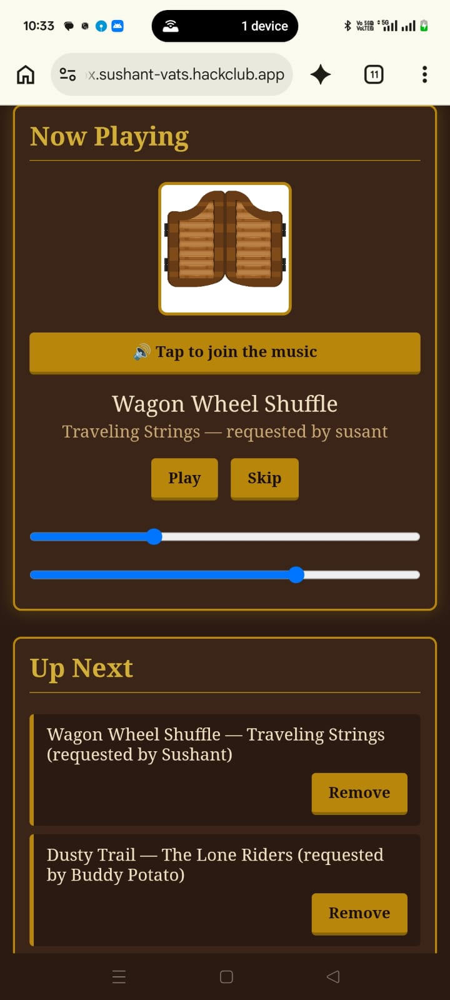

# A jukebox for the Saloon

It is a shared web jukebox for the saloon. Everyone pens the same site, add songs to one queue and the music plays in the browse. Built for the HackClub Pixel YSWS trial.

**Live demo:** https://jukebox.sushant-vats.hackclub.app

## Screenshots




## What it does

- You can request a song from the library and attach your name to it.
- It shows the current song playing with the artwork, artist and who requested it.
- It has one shared queue that everyone can see.
- It has Play, Pause, Skip, Seek and Volume controls.
- You can also remove song from the queue.
- The next song automatically starts when the previous one ends.
- The theme is Wild West saloon and it works on mobile too.

## What is Synced between devices

- The queue and the current song
- Requester names
- Play and pause
- Playback position and seeking
- Skip

A song only advance once, even when many people are connected.

## What is not synced
- **Volume** is per devices, so each person controls their own speaker.
- **Each device has to "Tap to join the music once**, because browser block audio until you interact with the page.

## Limitations 

- The queue is kept in the server's memory, so it resests if the server restarts.
- There is no login, so anyone can skip or remove songs.
- The songs come from a fixed library, not a search of all music.

## Tech Stack

- **Frontent:** HTML, CSS, vanilla Javascript
- **Backend:** Node.js, Express
- **Real-time sync:** Socket.I0
- **Hosting:** Hack Club Nes, kept running with pm2

## Running Locally

```
npm install
node server.js
```
Then open `http://localhost:3000` in your browser.

## Audio

All songs and artwork used here are royalty-free & sourced for this project as sample tracks to demonstrate playback functionality.

## Built By

Sushant - as a Hack Club YSWS trial project.